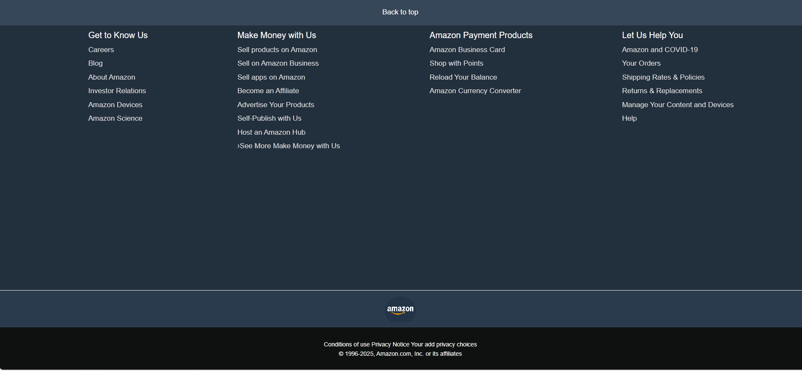

# Amazon Clone 🛒

A responsive Amazon Clone built using HTML and CSS. The project recreates the basic user interface and layout of Amazon.

## Features
- Responsive homepage
- Navigation bar
- Product sections
- Modern UI design
- Amazon-inspired layout

## Technologies Used
- HTML
- CSS

## How to Run

```bash
Open index.html
```
## Project Screenshots

### Homepage


### Product Section


### Navigation Bar


### Footer Section


## GitHub Repository
https://github.com/SimranBadwal2006/Amazon-Clone